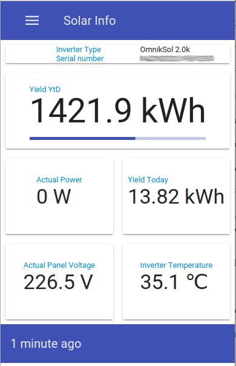

pv-datalogger
=============

Solar Power Panel Data Logger (in Java)


In 2014 I installed my own solar panels and now I want to have my own control over the data which is generated by the inverter.

My inverter is a OmnikSol 2.0k and I have a Wifi kit installed to remotely retrieve the data.


# Usage

The complete datalogger consists of three parts.

1. One tool (pvdatalogger) for polling the inverter or listening to inverter pushed data and which outputs a CSV line per received message to standard out.
2. One tool (pvdataloader) for reading standard input, expecting a CSV file which was produced in step 1, and which stores this data in a MongoDB database.
3. One web application (pvdatavisualizer) which uses the MongoDB database to present the data in a responsive web design.

Screenshot of the PVData Visualizer:




## Usage of pvdatalogger

```
usage: pvdatalogger
 -a,--address <ip or hostname>   The ip address or hostname of the
                                 inverter.
 -b,--bind <address>             The address of the interface to bind the
                                 listener to. Use 0.0.0.0 to bind to all
                                 interfaces
 -h,--help                       Print this help information.
 -i,--interval <minutes>         The polling interval in minutes. (Default
                                 is 5 minutes)
 -p,--port <port>                The port to listen on
 -r,--raw                        Also print raw data as a hex string
 -t,--type <poller|listener>     The type of logger to use
```
For poller mode use the -a and -i options.
For listener mode use the -b and -p options

## Usage of pvdataloader
```
usage: pvdatalogger
 -a,--address <address>     The MongoDB database address (default is
                            localhost).
 -d,--database <database>   The MongoDB database name in which all data is
                            stored (default is pvdata).
 -h,--help                  Print this help information.
 -p,--port <port>           The MongoDB database port (default is 27017).
```
If MongoDB is installed on the local machine with the default port, no parameters need to be passed to the data loader because of the default settings.

## Glueing the logger and loader together

To connect the pvdatalogger and the pvdataloader together, the output of the logger needs to be redirected to the input of the pvdataloader. Different ways to do this exist, but a simple example is:


```
java -jar pvdatalogger-0.0.1-SNAPSHOT-jar-with-dependencies.jar -r -t listener 1>> pvdata.log 2>> pvdatalogger.error.log &
java -jar pvdataloader-0.0.1-SNAPSHOT-jar-with-dependencies.jar < pvdata.log >> pvdataloader.error.log &
```
The first command will let the logger write all data to a text file called pvdata.log. Errors are output to pvdatalogger.error.log.
The second command will start the loader and uses the pvdata.log file as the input. All output is directed to the pvdataloader.error.log file. A MongoDB server is expected to run and listening at localhost port 27017.

# OmnikSol Data format

Not much information is available on the dataoutput of this inverter. But looking at a few other projects (see also https://github.com/Woutrrr/Omnik-Data-Logger) I did manage to define a few datastructures. The txt files in this project contain information on the dataformats used, for those interested!

Currently there is one project which contains a datalogger which still polls a javascript file from the inverters internal webpage. However, I started coding a small server listening to the pushed data from the inverter.

I recently saw information regarding another way to pull data. This is using a separate service which the inverter apparantly has. I have not yet been able to check this out yet.

## OmnikSol Message Format

Due to lightning, I had to replace my inverter and suddenly the software did not work properly anymore. After analysing the cause, I found out that the message format was different between the two inverters which had different firmware versions. Below are tables describing the message formats and what I have found out so far.

The two versions I have found, have a difference in the header which I think is the message version specifyer. The distinction for me are the 7D and 81 values.

The 7D version message size is 170 and the 81 version message size is 174.

### Common for both message versions
 
The hex column and dec column show the position in the message in bytes. The length gives the length of the fields in bytes. 
The type describes how the data is encoded, see the type explanation further down below. The description is, eugh well, the description!

| HEX | DEC | LENGTH | TYPE       | DESCRIPTION
| --- | --- | ------ | ---------- | --------------------------------------
| 00  | 000 | [1]    |            | Fixed value [68] (same as request message)	
| 01  | 001 | [1]    |            | Message version 7D or 81 hex
| 02  | 002 | [2]    |            | Always the same [41 b0]
| 04  | 004 | [4]    | UINT32 LE  | Data Logger Serial Number
| 08  | 008 | [4]    | UINT32 LE  | Data Logger Serial Number (repeated!?)
| 0C  | 012 | [3]    |            | Always the same [81 02 01]
| 0F  | 015 | [15]   | CHAR       | Inverter Serial Number
| 1F  | 031 | [2]    | INT16 BE   | Temperature
| 21  | 033 | [2]    | INT16 BE   | vpv1	Voltage Panels 1st String
| 23  | 035 | [2]    | INT16 BE   | vpv2	Voltage Panels 2nd String
| 25  | 037 | [2]    | INT16 BE   | vpv3	Voltage Panels 3rd String
| 27  | 039 | [2]    | INT16 BE   | ipv1	Current Panels 1st String
| 29  | 041 | [2]    | INT16 BE   | ipv2	Current Panels 2nd String
| 2B  | 043 | [2]    | INT16 BE   | ipv3	Current Panels 3rd String
| 2D  | 045 | [2]    | INT16 BE   | iac1	Current AC Phase 1
| 2F  | 047 | [2]    | INT16 BE   | iac2	Current AC Phase 2
| 31  | 049 | [2]    | INT16 BE   | iac3	Current AC Phase 3
| 33  | 051 | [2]    | INT16 BE   | vac1	Voltage AC Phase 1
| 35  | 053 | [2]    | INT16 BE   | vac2	Voltage AC Phase 2
| 37  | 055 | [2]    | INT16 BE   | vac3	Voltage AC Phase 3
| 39  | 057 | [2]    | INT16 BE   | fac1	Frequency AC Phase 1
| 3B  | 059 | [2]    | INT16 BE   | pac1	Power AC Phase 1
| 3D  | 061 | [2]    | INT16 BE   | fac2	Frequency AC Phase 2
| 3F  | 063 | [2]    | INT16 BE   | pac2	Power AC Phase 2
| 41  | 065 | [2]    | INT16 BE   | fac3	Frequency AC Phase 3
| 43  | 067 | [2]    | INT16 BE   | pac3	Power AC Phase 3
| 45  | 069 | [2]    | INT16 BE   | yield today
| 47  | 071 | [4]    | UINT32 BE  | yield total
| 4B  | 075 | [4]    | UINT32 BE  | inverter total hours since last reset
| 4F  | 079 | [18]   |            | always same values (000100000000FFFF00000000000000000000)

Type explanation

| TYPE      |
| --------- | ---------------------------------------------------
| UINT32 LE | Unsigned Integer 32 bits, Little Endian encoded
| INT16 BE  | Unsigned Integer 16 bits, Big Endian encoded
| CHAR      | Each byte value is a (ASCII) character


### Specific for a certain version

The table below shows the differences between message versions. The description is leading.

The two versions currently known are 7D and 81. 

| 7D      | 7D      | 81      |81       |   -        | -
| ------- | ------- | ------- | ------- | ---------- | ---------------------------------------------
| **HEX** | **DEC** | **HEX** | **DEC** | **LENGTH** | **DESCRIPTION**
| n/a     | n/a     | 61      | 097     | [4]        | changing value?????
| 61      | 097     | 65      | 101     | [15]       | firmware version (main)
| 70      | 112     | 74      | 116     | [5]        | ??? 00 values
| 75      | 117     | 79      | 121     | [9]        | firmware version (slave)
| 7E      | 126     | 82      | 130     | [11]       | always same values (0000000000000000000000)
| 89      | 137     | 8D      | 141     | [1]        | Changing value
| 8A      | 138     | 8E      | 142     | [5]        | always same values (16681141f0)
| 8F      | 143     | 93      | 147     | [4]        | Data Logger Serial Number
| 93      | 147     | 97      | 151     | [4]        | Data Logger Serial Number (repeated)
| 97      | 151     | 9B      | 155     | [17]       | Status Message [DATA SEND IS OK]
| A8      | 168     | n/a     | n/a     | [1]        | Changing value (CHECKSUM??)
| n/a     | n/a     | AC      | 172     | [1]        | always same values (2B)
| A9      | 169     | AD      | 173     | [1]        | Fixed value [16] (same as request message)
